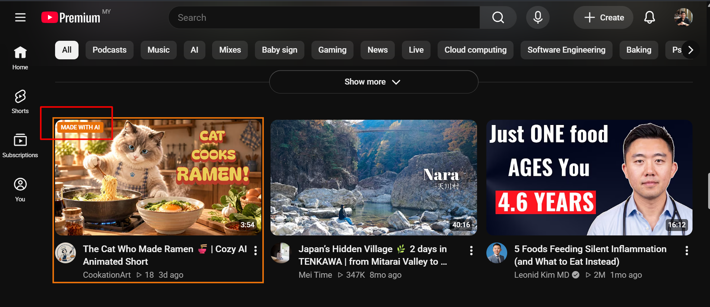
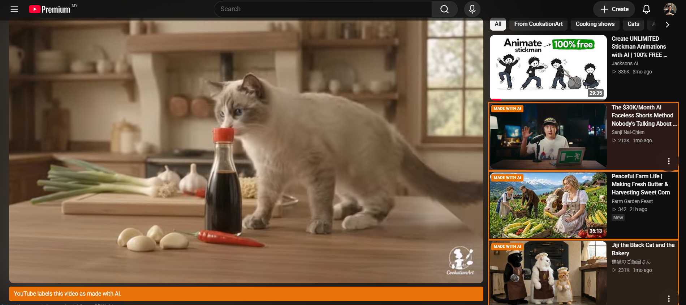
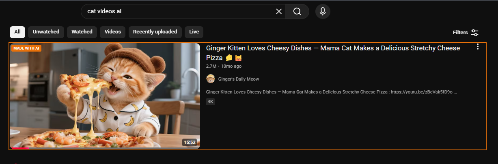
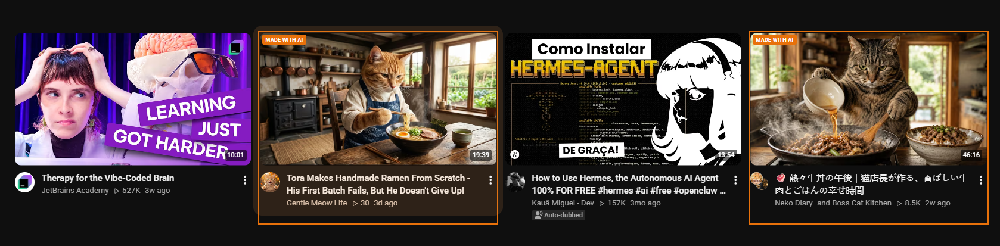

# YouTube AI Flagger

A Chrome extension that highlights YouTube videos that YouTube itself labels **"Made with AI"**. It adds an orange border and a badge on video cards, and a banner on the watch page.

It doesn't hide or block anything. It just makes YouTube's AI label visible before you click.



## Why

YouTube shows its "Made with AI" label only inside a video's description, under **How this was made**. You don't see it on the home feed, in search results or in recommended videos. This extension brings that label out onto the video cards.

## Screenshots

**Watch page:** a banner under the player, and flagged videos in the sidebar.



**Search results**



**Video grid:** only the AI-labelled videos are flagged. The auto-dubbed video next to them is not.



## What gets flagged

A video is flagged only when YouTube's **How this was made** section says **Made with AI**. Some examples:

| YouTube says | Flagged? |
|---|---|
| Made with AI | Yes |
| Made with AI · Info from OpenAI | Yes, and the banner shows the attribution |
| Auto-dubbed | No |
| No "How this was made" section | No |

Keep in mind:
- **Not flagged doesn't mean not AI.** The label is mostly self-disclosed by creators. AI videos without the label won't be flagged.
- **Channels and keywords:** you can also flag any channel or title keyword yourself. These cards get a **YOUR LIST** badge instead.

## Install

A Chrome Web Store version is coming soon. Until then, you can install it manually:

1. Clone or download this repo.
2. Open `chrome://extensions` in Chrome, Edge, Brave or another Chromium browser.
3. Turn on **Developer mode**.
4. Click **Load unpacked** and select the repo folder.
5. Refresh any open YouTube tabs.

After pulling updates, click the reload icon on the extension's card in `chrome://extensions`, then refresh YouTube.

## Settings

Right-click the extension icon and choose **Options**:

- **Enable flagger:** turns everything on or off.
- **Flag videos YouTube labels "Made with AI":** turns the AI label check on or off.
- **Channels to flag:** one channel name per line; it must match exactly, but capitalisation doesn't matter.
- **Title keywords to flag:** one per line; any title containing the keyword is flagged.

Settings are stored with `chrome.storage.sync`, so they follow your Chrome profile.

## How it works

- **Watch page:** when you open a video, the extension looks up that video's label and shows a banner and a brief notification if it's "Made with AI".
- **Video cards:** cards don't contain the label, so the extension looks it up for each card as it scrolls near the screen. It supports home, search, channel pages and the watch page sidebar.
- **The lookup:** a request to YouTube's own `/youtubei/v1/next` endpoint, the same data that powers the watch page. It asks for English (`hl=en`), so detection works whatever language your YouTube is set to.
- **Load on YouTube:** at most 3 lookups run at once. Results are cached in `chrome.storage.local` for 7 days, so each video is checked once a week at most.

### Privacy

- **No outside services:** requests go only to `www.youtube.com`.
- **Not signed in:** lookups are sent without your cookies, so they aren't tied to your account and don't affect your watch history or recommendations.
- **Nothing collected:** the only data stored is your settings and the label cache, both in your browser.

## Limitations

- **YouTube changes:** the lookup reads YouTube's internal data format. If YouTube changes it, flags will stop appearing until the extension is updated.
- **Short delay:** badges appear a moment after cards load, since each video needs a lookup first.
- **Shorts and playlists:** playlist and mix cards aren't checked. Shorts cards are checked when they link to `/shorts/<id>`.

## Project structure

```
manifest.json         Extension manifest (Manifest V3)
content.js            Runs on youtube.com: label lookups, card badges, banner, notifications
settings.js           Shared settings defaults and loader
options.html          Settings page
options.js            Settings page logic
icons/                Extension icons
screenshots/          README screenshots
```
